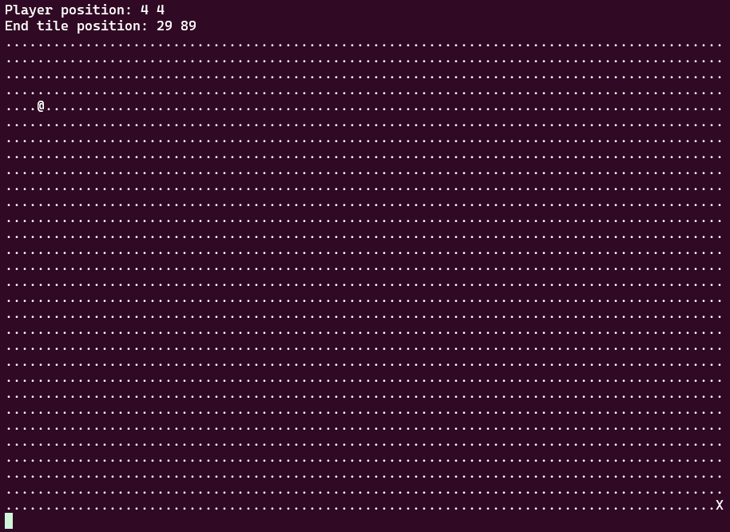

# babygame02

*Hard*

>### Description
>Break the game and get the flag.\
Welcome to BabyGame 02! Navigate around the map and see what you can find! The game is available to download [here](game). There is no source available, so you'll have to figure your way around the map. You can connect with it using `nc saturn.picoctf.net 57551`.

### Solution

We can play a little game where we have to get to the bottom right of the map. We can input 'w','a','s','d' to move. 



We run `checksec` on the binary file to get some info.
```sh
Arch:       i386-32-little
RELRO:      Partial RELRO
Stack:      No canary found
NX:         NX enabled
PIE:        No PIE (0x8048000)
Stripped:   No
```
Most importantly, little endian, there is no canary, and we cannot execute things we write on the stack (NX).

Lets decompile the binary using **Ghidra** to find out what the program really does.\
The `main()` function:
```c
undefined4 main(void)

{
  int iVar1;
  int local_aa8;
  int local_aa4;
  undefined local_a9d [2700];
  char local_11;
  undefined *local_10;
  
  local_10 = &stack0x00000004;
  init_player(&local_aa8);
  init_map(local_a9d,&local_aa8);
  print_map(local_a9d,&local_aa8);
  signal(2,sigint_handler);
  do {
    do {
      iVar1 = getchar();
      local_11 = (char)iVar1;
      move_player(&local_aa8,(int)local_11,local_a9d);
      print_map(local_a9d,&local_aa8);
    } while (local_aa8 != 0x1d);
  } while (local_aa4 != 0x59);
  puts("You win!");
  return 0;
}
```

We can see the main loop that moves the player and prints the map, until the player is at the bottom right (local_aa8 == 0x1d and local_aa4 == 0x59).\
Now lets look at how the user input gets used in the `move_player()` method:

```c
void move_player(int *param_1,char param_2,int param_3)

{
  int iVar1;
  
  if (param_2 == 'l') {
    iVar1 = getchar();
    player_tile = (undefined)iVar1;
  }
  if (param_2 == 'p') {
    solve_round(param_3,param_1);
  }
  *(undefined *)(*param_1 * 0x5a + param_3 + param_1[1]) = 0x2e;
  if (param_2 == 'w') {
    *param_1 = *param_1 + -1;
  }
  else if (param_2 == 's') {
    *param_1 = *param_1 + 1;
  }
  else if (param_2 == 'a') {
    param_1[1] = param_1[1] + -1;
  }
  else if (param_2 == 'd') {
    param_1[1] = param_1[1] + 1;
  }
  *(undefined *)(*param_1 * 0x5a + param_3 + param_1[1]) = player_tile;
  return;
}
```

Use 'l' to change the player icon, to be able to write any bytes you want. Use 'p' to directly go to the end, and finish the game.\
Notice that there is no check for wasd inputs that generates out of bounds memory writes (not) to the map array. This allows us to write anything on the stack anywhere. But when we move away from a location, it sets the old byte to 0x2e. So we actually only can really write 1 byte.

There is no logic anywhere to get to the `win()` function. So we probably have to manipulate some return address to return to the win function. The address of the win function is `0x0804975d`, but since we can only manipulate 1 byte, we have to find some place where the return address looks like `0x080497__`. Then we must replace the lsb with 0x5d, which is the ']' character. 

The function `move_player()` has return address (that gets pop'ed into $ip during the "ret") 0x08049709 (to main). This is something we can use! Now, with gdb, find the difference/offset between the lsb of the address and the beginning of the map (our reference point). Keep in mind little endian. 

The stack just before the `ret` statement in `move_player()`:
<pre>
0xffffc69c:     0x080497<b>09</b>      0xffffc6b8      0x00000077      0xffffc6c3
0xffffc6ac:     0x080496eb      0x464c457f      0x03010101      0x00000000
0xffffc6bc:     0x00000033      0x2e<b>2e</b>0003      0x2e2e2e2e      0x2e2e2e2e
0xffffc6cc:     0x2e2e2e2e      0x2e2e2e2e      0x2e2e2e2e      0x2e2e2e2e
0xffffc6dc:     0x2e2e2e2e      0x2e2e2e2e      0x2e2e2e2e      0x2e2e2e2e
</pre>
We find that the difference between them (in bold) is 38 bytes.

We don't want to overwrite a lot of the stack between the two values. So instead of going from (0 0) to (0 -38) using 'a', we can go to (0 51) and use one move 'w' to go to (0 -38). Keep in mind you want the player tile to be ']' before you do the final move up. 

So, to solve:
- Change player tile to ']' with "l]"
- Manually move to location (0 51)
- Move up with 'w'

WHAT, when I try this on the picoCTF netcat version it does not work... When I locally run this it does work?!

>I was so happy first, and then it did not work :( So I found a [writeup](https://blog.ry4n.org/babygame02-picoctf-writeup-6bf57b54f7b3) that had the same problem. It literally says: "After some trial and error, I discovered jumping to 0x8049760 printed the flag on the remote service!"

So use the ` (0x60) character instead of ] (0x5d), and just exploit on the remote server :)

<details>
<summary>Yes! We got the flag:</summary> 
picoCTF{gamer_jump1ng_4r0unD_f35ef31a}
</details>