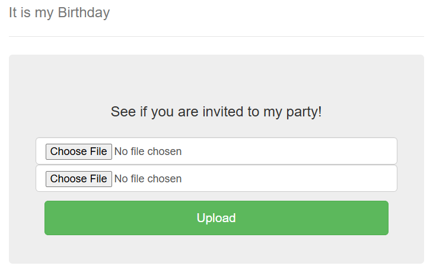

# It is my Birthday

*Medium*

>### Description
>I sent out 2 invitations to all of my friends for my birthday! I'll know if they get stolen because the two invites look similar, and they even have the same md5 hash, but they are slightly different! You wouldn't believe how long it took me to find a collision. Anyway, see if you're invited by submitting 2 PDFs to my website. http://mercury.picoctf.net:55343/

## Solution

### Recon

The webpage asks us for two pdf files.



When we try to upload some file that doesn't have a .pdf extension is will give an error message "Not a PDF!". And when we upload the same .pdf file twice it will give an error message "Files are not different!".

But the files need to have the same MD5 hash. So we must find a MD5 hash collision, and upload them as two different files.

### Exploit

Google on MD5 collisions, I find these blocks that produce the same MD5 hash:
```
d131dd02c5e6eec4693d9a0698aff95c 2fcab58712467eab4004583eb8fb7f89 
55ad340609f4b30283e488832571415a 085125e8f7cdc99fd91dbdf280373c5b 
d8823e3156348f5bae6dacd436c919c6 dd53e2b487da03fd02396306d248cda0 
e99f33420f577ee8ce54b67080a80d1e c69821bcb6a8839396f9652b6ff72a70
```
And
```
d131dd02c5e6eec4693d9a0698aff95c 2fcab50712467eab4004583eb8fb7f89 
55ad340609f4b30283e4888325f1415a 085125e8f7cdc99fd91dbd7280373c5b 
d8823e3156348f5bae6dacd436c919c6 dd53e23487da03fd02396306d248cda0 
e99f33420f577ee8ce54b67080280d1e c69821bcb6a8839396f965ab6ff72a70
```

Use hexedit to put this into two pdf files, now upload these to the website.

<details>
<summary>Yes! We got the flag:</summary> 
picoCTF{c0ngr4ts_u_r_1nv1t3d_aad886b9}
</details>